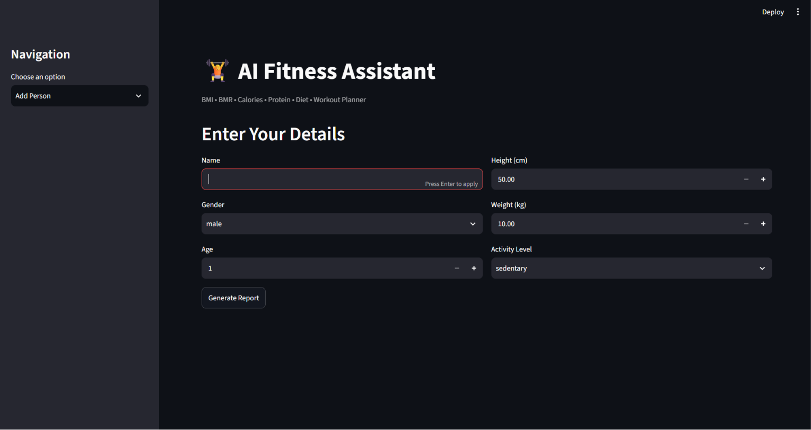
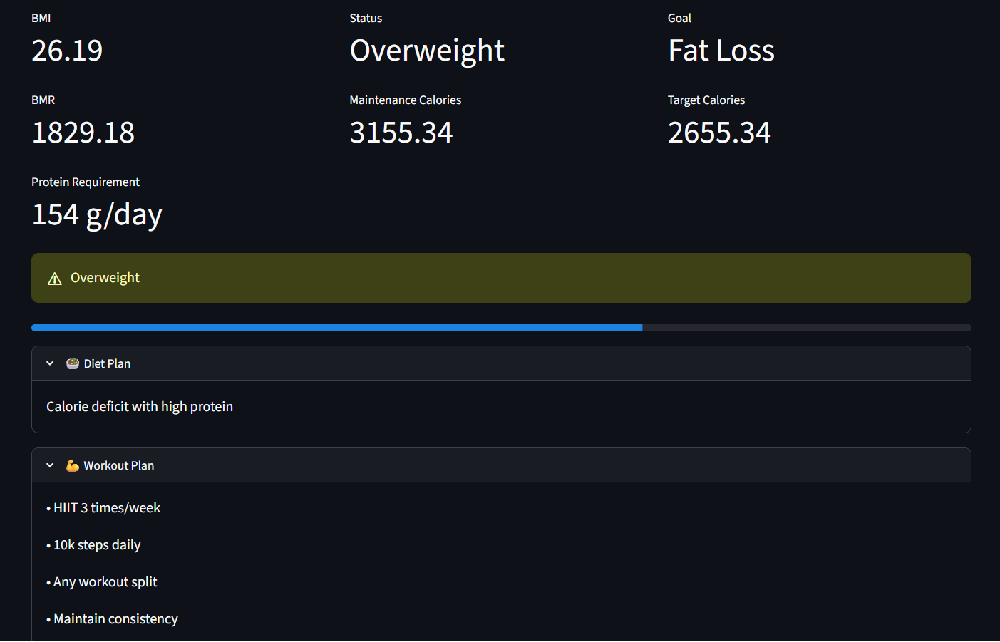

# 🏋️ AI Fitness Assistant

A Python-based fitness assistant that calculates BMI, BMR, calories, protein requirements, and generates personalized diet and workout plans — with a Streamlit web interface and Gemini AI integration.



---

## 🚀 Features

- BMI calculation with health status
- BMR using Mifflin-St Jeor formula
- Maintenance and target calorie calculation
- Protein requirement based on goal
- Personalized diet and workout plans
- AI-generated fitness plans using Gemini API
- Fitness history saved to CSV
- Interactive charts for BMI, Weight, and Protein
- Download history as CSV
- Terminal menu system + Streamlit web app

---

## 🛠️ Tech Stack

- **Python**
- **Streamlit** — web interface
- **Google Gemini API** — AI-generated fitness plans
- **CSV** — local data storage
- **python-dotenv** — secure API key management

---

## 📁 Project Structure

```
AI-Fitness-Assistant/
├── FitnessAssistant.py   # Core logic (BMI, BMR, calories, workout, diet)
├── storage.py            # Save and view CSV history
├── main.py               # Terminal menu system
├── app.py                # Streamlit web app
├── requirements.txt      # Dependencies
├── .env                  # API key (not uploaded to GitHub)
├── .gitignore
└── README.md
```

---

## ⚙️ Setup & Installation

**1. Clone the repo**
```bash
git clone https://github.com/aarush77187/AI-Fitness-Assistant.git
cd AI-Fitness-Assistant
```

**2. Install dependencies**
```bash
pip install -r requirements.txt
```

**3. Set up your Gemini API key**

Create a `.env` file in the project folder:
```
GEMINI_API_KEY=your_api_key_here
```

Get a free API key from [Google AI Studio](https://aistudio.google.com)

> Note: Gemini API requires a Google Cloud account with billing enabled in some regions. New users get $300 free credits at [cloud.google.com/free](https://cloud.google.com/free)

**4. Run the Streamlit app**
```bash
streamlit run app.py
```

**Or run the terminal version**
```bash
python main.py
```

---

## 📊 How It Works

1. Enter your details — name, age, gender, height, weight, activity level
2. Click **Generate Report**
3. Get your BMI, BMR, calorie targets, and protein requirement
4. View your personalized diet and workout plan
5. Get an AI-generated plan from Gemini
6. All data saved to history with charts

---

## 📸 Screenshots



---

## 🔮 Future Improvements

- User login and multi-user support
- Weekly progress tracking
- Meal suggestions with nutrition breakdown
- Mobile-friendly UI
- Deploy to Streamlit Cloud

---

## 👤 Author

**Aarush**  
GitHub: [@aarush77187](https://github.com/aarush77187)
